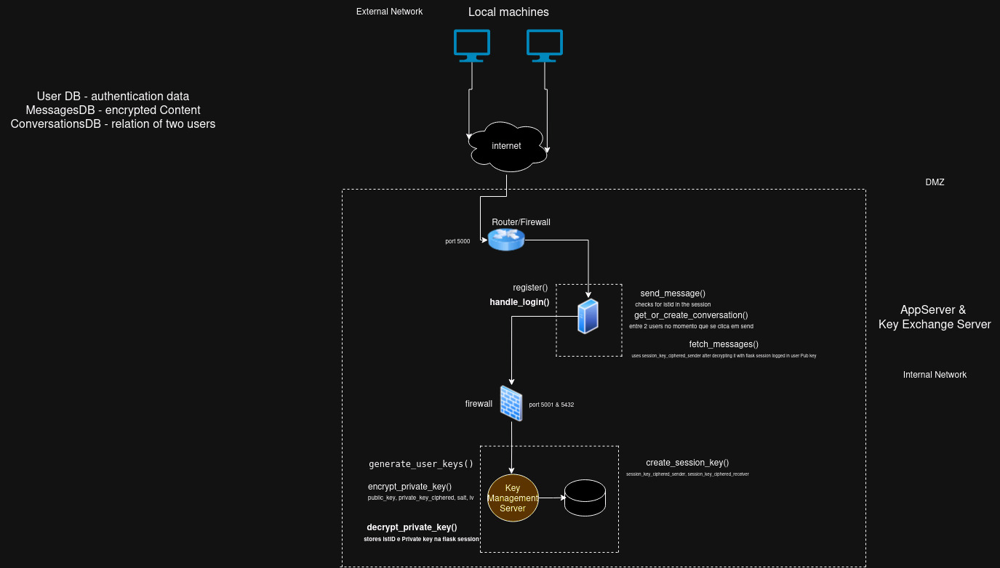

# T25 MessagIST Project Read Me

## Team

| Number  | Name              | User                                 | E-mail                                   |
| --------|-------------------|--------------------------------------| -----------------------------------------|
| 103299  | Rodrigo Alves     | <https://github.com/rodrigo-l-alves> | <rodrigo.lucas.alves@tecnico.ulisboa.pt> |
| 102803  | Afonso Pires      | <https://github.com/afonsopires1>    | <afonso.p.pires@tecnico.ulisboa.pt>      |
|  93581  | João Lobato       | <https://github.com/jlobo912>        | <joao.c.lobato@tecnico.ulisboa.pt>       |
  

  


## Contents

This repository contains documentation and source code for the *Network and Computer Security (SIRS)* project.

The [REPORT](REPORT.md) document provides a detailed overview of the key technical decisions and various components of the implemented project.
It offers insights into the rationale behind these choices, the project's architecture, and the impact of these decisions on the overall functionality and performance of the system.

This document presents installation and demonstration instructions.

## Installation

To see the project in action, it is necessary to setup a virtual environment, with 1 network and 2 machines.  

The following diagram shows the network and machines:




### Prerequisites

All the virtual machines are based on: Linux 64-bit, Kali 2023.3  

[Download](https://www.kali.org/get-kali/#kali-virtual-machines) a virtual machine of Kali Linux 2023.3.  
Clone the base machine to create the other machines.

### Machine configurations

For each machine, there is an initialization script with the machine name, with prefix `init-` and suffix `.sh`, that installs all the necessary packages and makes all required configurations in the a clean machine.

Inside each machine, use Git to obtain a copy of all the scripts and code.

```sh
$ git clone https://github.com/tecnico-sec/T25.git
```

Next we have custom instructions for each machine.

# Machine 1 - Database Setup Instructions

This machine runs a database for storing messages. Follow these steps to set it up:

---

## 1. Access PostgreSQL and Create the Database

Run the following commands to switch to the PostgreSQL user and access the database management system:

```sh
$ sudo -i -u postgres
$ psql
```

## 2. Create Tables
Open the file [DatabaseReport](database/database_code.txt) and copy the SQL instructions one by one into the PostgreSQL prompt.

## 3. Verify Tables
To ensure the tables were created correctly, run the following commands inside the PostgreSQL prompt:

 - To list all tables:

 ```sh
$ \dt
 ```

 - To describe a table(e.g., users):
    
```sh
\d users
```
Compare the structure of your tables with the details provided in [DatabaseArquitecture](database/database_architecture.txt).

## 4. Exit PostgreSQL
To exit the PostgreSQL prompt, run: 

```sh
$ \q
```

## 5. Start the Database Service
Run the following command to start the PostgreSQL service:

```sh
$ sudo systemctl start postgresql
```

## 6. Test the Setup
Verify the setup by running a test command. For example:

 -Access the database:
```sh
$  psql -U postgres
```

 -Query a table to confirm it exists:
```sh
SELECT * FROM users;
```

The expected results are that the table of the users will be equal to the one the in the [DatabaseArquitecture](database/database_architecture.txt)


If you receive the following message "Hi!" this message would be saved in the messages database, and could be seen by accessing the messages database. It also would have information of the sender, receiver and much more.


# Machine 2 - AppServer

---

## 1. Access the Python Script of the AppServer

Using the terminal, run the Python script of the appserver:

```sh
$ python appserverv3.py
```
After running this command, three links will appear. Click the one with the IP format 10.X.X.X by shift+left-click.


## 2. Create Users

In the [LoginPage](img/login.png)

Now, open two separate private tabs in your browser, each with the link you clicked above. In each tab, create a user by registering with a **username** and **password** (ensure you don't use your own credentials). 

When registering, a **private key** will be downloaded as a `.txt` file. **Save both the private key and the username/password** for each user. After registration, log in with each user.

## 3. Creating a Conversation Between Users

In the [ChatPage](img/chat.png)

1. **Import the private key** for each user:
    - User A will import their own private key and add User B to the "receiver" section.
    - User B will import their own private key and add User A to the "receiver" section.
      
      Note that the private key is not imported to the server. Instead, it is imported to the user's own browser, where the encryption and decryption processes occur

2. Click **"Load Conversation Key"** to create a conversation key between the two users.

3. In the **message input field** of one user, type a message (e.g., "Hi!") and send it.

4. In the other tab, click **"Refresh Messages"**, and the message ("Hi!") will appear.

5. If you refresh the page, the **active conversation** column will show both users as active conversations.

---


# FireWall

Now that all the networks and machines are up and running, and you've followed the setup steps, you should have:

- Two users created,
- One message successfully sent,
- The database up and running.

To verify if the message was saved correctly, you can access the database and check for the message, users, and conversations there.

---

## Install VS Code and Set Up the Port

1. **Open VS Code** and sign in with your GitHub account.
2. After the Python script is already running, do **Ctrl + Shift + P** and type Ports, choose **View: Toogle Ports**.
3. Choose **Forward a Port**, enter `5000` as the port number and press Enter.
4. Use the generated link (e.g., `https://nm6vv7hf-5000.uks1.devtunnels.ms`) to access your app externally. You're going to need this link for the firewall setup.

**Note**: Port forwarding resets when you close VS Code.


---

## Setting Up the Firewall

The last step is to configure the firewall. You can do this by following the commands in the [FireWall](firewall/firewall.txt).

> **Note:** In the following lines:

```bash
sudo iptables -A OUTPUT -p tcp -d nm6vv7hf-5000.uks1.devtunnels.ms --dport 443 -j ACCEPT
sudo iptables -A INPUT -p tcp -s nm6vv7hf-5000.uks1.devtunnels.ms --sport 443 -j ACCEPT
```
The "nm6vv7hf-5000.uks1.devtunnels.ms" part should be replaced with the address provided by VS Code after you setup port forwarding on VS Code.

---

Once the firewall is configured, your project is fully implemented, and you can start creating more interactions between other users.

# Demonstration


This concludes the demonstration.


## Additional Information

### Links to Used Tools and Libraries

- [Java 11.0.16.1](https://openjdk.java.net/)
- [Maven 3.9.5](https://maven.apache.org/)

### Versioning

We use [SemVer](http://semver.org/) for versioning.  

### License

This project is licensed under the MIT License - see the [LICENSE.txt](LICENSE.txt) for details.

----
END OF README
