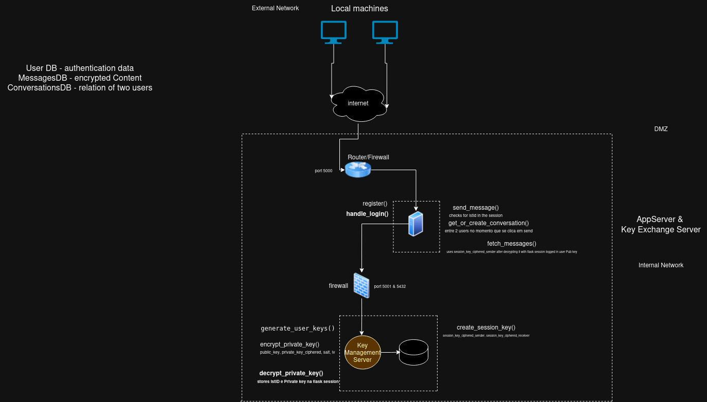
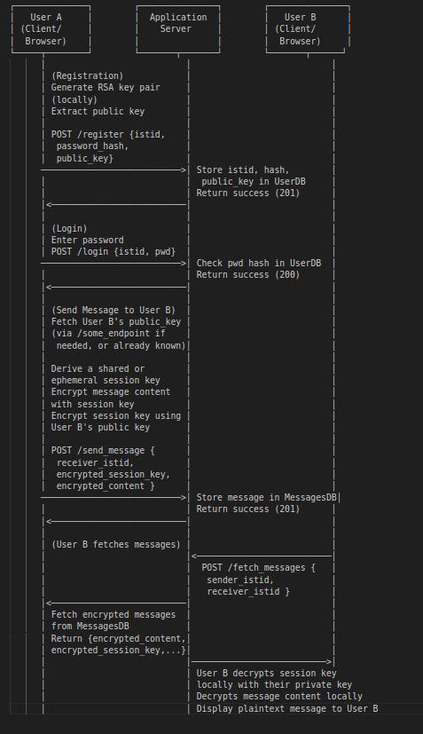

# T25 MessageHub Project Report

## 1. Introduction

This project implements a secure end-to-end encrypted (E2E) messaging system designed to ensure the confidentiality and integrity of user communications. The business scenario involves a messaging platform where the server acts as a storage and relay service but is fully untrusted for message confidentiality. The system consists of three main components:
 
1. **Secure Message Handling:** End-to-end encrypted messages are securely stored and transmitted.
2. **Infrastructure:** A client-server architecture with a clear separation between cryptographic operations on the client and data storage on the server.
3. **Security Challenge:** Protecting data integrity and confidentiality against an untrusted server and other potential attackers.

The system uses public-key cryptography for key exchange and symmetric encryption for message confidentiality. Below is a UML structural diagram representing the high-level design:



## 2. Project Development

### 2.1. Secure Document Format

#### 2.1.1. Design

Our secure document format is built around an AES-GCM encryption scheme for message content, which provides confidentiality, integrity, and authenticity. A unique symmetric session key is generated per conversation and is encrypted separately for the sender and receiver using RSA-OAEP.

- **Format Design:**
  - `encrypted_content`: The AES-GCM encrypted message.
  - `iv`: Initialization vector for AES-GCM.
  - `tag`: Authentication tag from AES-GCM.
  - `encrypted_session_key_sender`: The session key encrypted with the sender's public key.
  - `encrypted_session_key_receiver`: The session key encrypted with the receiver's public key.

**Example:**
```json
{
    "encrypted_content": "4JfQnY5M...",
    "iv": "3Dcd...",
    "tag": "9eFf...",
    "encrypted_session_key_sender": "MIIBCgK...",
    "encrypted_session_key_receiver": "MIIBCgK..."
}
```

#### 2.1.2. Implementation

Our solution to this project adheres strictly to the principles of end-to-end encryption, ensuring that encryption and decryption of all sensitive data are performed entirely on the client side. Below are the detailed steps and components of our implementation:

- **Frontend (Client-Side):**
  - We utilized **JavaScript** and the **Web Cryptography API**, which is a native browser API designed for secure cryptographic operations. This ensures that all cryptographic actions, including:
    - **Key generation:** RSA key pairs for asymmetric encryption and AES keys for symmetric encryption.
    - **Encryption:** Encrypting messages with AES-GCM and encrypting session keys with RSA-OAEP.
    - **Decryption:** Decrypting session keys with the client's RSA private key and decrypting message content with AES-GCM.
  - The private key is generated directly on the client and is never transmitted to the server. Users download their private keys immediately after generation and are required to re-import them manually (via file upload) when needed, ensuring the server has no access to sensitive key material.

- **Backend (Server-Side):**
  - The server, implemented using **Python with Flask**, is solely responsible for storing and relaying encrypted messages and session keys. The server does not perform any encryption or decryption of sensitive data, adhering to the zero-trust principle.
  - **PostgreSQL** is used as the database, where all stored data is in its encrypted form:
    - `encrypted_content`: The AES-GCM encrypted message.
    - `iv` and `tag`: Initialization vector and authentication tag for AES-GCM.
    - `encrypted_sessionkey_sender` and `encrypted_sessionkey_receiver`: Session keys encrypted with the RSA public keys of the sender and receiver, respectively.

- **Cryptographic Workflow:**
  - When a user sends a message:
    - A new AES session key is generated on the client side.
    - The message content is encrypted with this AES session key using AES-GCM.
    - The AES session key is then encrypted twice: once with the sender's RSA public key and once with the receiver's RSA public key.
    - The encrypted content, session keys, IV, and tag are sent to the server for storage.
  - When a user retrieves messages:
    - The server delivers the encrypted message, session keys, IV, and tag to the client.
    - The client decrypts the session key using their RSA private key.
    - The decrypted session key is then used to decrypt the message content.

---

##### **Challenges Overcome**

1. **Ensuring Private Keys Never Leave the Client:**
   - Private keys are generated exclusively on the client side using the Web Cryptography API.
   - These keys are securely stored locally by the user and uploaded back to the browser only when needed. This approach ensures that the server never has access to any private key material, preserving the integrity of end-to-end encryption.

2. **Managing Session Key Lifecycle:**
   - Session keys are created per conversation on the client and distributed securely (encrypted with both the sender's and receiver's public keys).
   - These keys are stored encrypted in the `conversations` table on the server, allowing participants to decrypt them independently while maintaining the ability to decrypt past messages.

3. **Server's Role Limited to Storage:**
   - The server does not perform any cryptographic operations involving plaintext data. It operates solely as a passive storage and relay mechanism for encrypted messages and keys.

4. **Maintaining Usability Without Compromising Security:**
   - While private key upload and download might introduce usability challenges, this trade-off ensures complete client-side control over encryption keys.
   - Future enhancements (e.g., leveraging browser `IndexedDB` for secure local storage) can improve usability while adhering to the same security principles.

---

##### **Key Takeaway**

This implementation rigorously enforces end-to-end encryption, ensuring that sensitive operations such as encryption and decryption are confined to the client. The server is treated as an untrusted entity, making it impossible for any server-side compromise to expose user messages or keys. 


### 2.2. Infrastructure

#### 2.2.1. Network and Machine Setup


- **Setup Overview:**
  - A single backend server for handling API requests and storing encrypted data.
  - Client-side operations run on user browsers, ensuring private keys are never sent to the server.

- **Technology Choices:**
  - **Server:** Python (Flask) and PostgreSQL.
  - **Client:** Web Cryptography API for platform-agnostic cryptographic operations.

- **Justification of Choices:**
  - **Simplicity and Scalability:**
    - A single backend server with a modular design is easy to scale horizontally if needed, allowing for the seamless handling of increased traffic.
    - The separation of cryptographic operations (client-side) and data storage (server-side) ensures clear division of responsibilities and minimizes attack surfaces.
  - **Security and Compliance:**
    - Python and Flask are widely used in security-critical applications, with extensive community support for secure coding practices.
    - PostgreSQL’s robust access controls and encryption support align well with the system’s security requirements.
  - **Client-Side Cryptography:**
    - The Web Cryptography API is a native solution designed for secure client-side operations, eliminating dependency on third-party libraries while ensuring strong security guarantees.
    - This approach adheres to the zero-trust model, as the server only handles encrypted data and cannot decrypt any messages or session keys.

#### 2.2.2. Server Communication Security

- **Secure Channels:**
  - HTTPS (TLS 1.2/1.3) for server-client communication.
  - Session keys are encrypted with RSA-OAEP, ensuring no plaintext key material is exposed.

- **Key Distribution:**
  - RSA public-private key pairs are generated client-side.
  - Public keys are exchanged securely and stored in the database.
  - Session keys are encrypted with the respective public keys and stored on the server.

---

### 2.3. Security Challenge

#### 2.3.1. Challenge Overview

**Security Challenge A:**

The initial design focused on ensuring compliance with basic regulatory requirements such as GDPR, using encryption to protect user data. However, this was deemed insufficient by security experts from IST, necessitating the implementation of a robust end-to-end encryption (E2E) mechanism. The revised design addresses the following enhanced security requirements:

1. **[SRA1: Confidentiality]** Only sender and receiver can see the content of the messages:
   - This requirement emphasizes the need for true end-to-end encryption, ensuring that the server acts solely as a passive relay/storage mechanism without access to plaintext messages or keys.
   - **Impact:** The cryptographic model was redesigned to move all encryption and decryption operations entirely to the client side. RSA public-private key pairs are generated on the client, and AES-GCM is used for message encryption, with session keys encrypted using RSA-OAEP.

2. **[SRA2: Confidentiality]** There must be a protocol that allows two students to exchange a key (in a secure way):
   - A secure key exchange protocol ensures that a session key can be established between two users without interception by any third party, including the server.
   - **Impact:** A secure side channel was assumed to distribute RSA public keys, allowing each client to encrypt the session key with the receiver's public key and the sender's public key. The session key is then securely stored in the conversations table, ensuring mutual confidentiality.

3. **[SRA3: Availability]** If a user loses their phone, they must be able to recover the message history:
   - This requirement ensures that encrypted messages remain accessible to both sender and receiver even if their devices are lost, without compromising the confidentiality of the stored data.
   - **Impact:** The session key for each conversation is encrypted with both the sender’s and receiver’s public keys and stored on the server. This design allows users to retrieve the encrypted session key, decrypt it with their private key, and access past messages.

---

**Impact on Original Design:**
- The original design relied on basic server-side encryption to protect messages. However, to meet the enhanced requirements, the encryption model was shifted entirely to the client side, ensuring stronger confidentiality and compliance with the zero-trust architecture.
- Key management was significantly enhanced to allow secure key exchange (via RSA public keys) and reliable recovery of encrypted session keys.
- The server's role was reduced to storage and forwarding, with no involvement in cryptographic operations, aligning with the principle of minimizing attack surfaces.

This redesigned system ensures robust compliance with the stated security requirements while maintaining usability for end users.

#### 2.3.2. Attacker Model

- **Fully Trusted:**
  - The sender and receiver (client devices only).
- **Partially Trusted:**
  - None; the server is considered fully untrusted.
- **Attacker Capabilities:**
  - Access to encrypted data on the server.
  - Ability to attempt man-in-the-middle (MITM) attacks on communication.


#### 2.3.3. Solution Design and Implementation

- **Redesign for E2E Security:**
  - All cryptographic operations (key generation, encryption, decryption) occur on the client side.
  - Messages are encrypted with AES-GCM, and session keys are encrypted with RSA-OAEP.
  - Encrypted session keys are stored in the conversations table for retrieval by sender/receiver.

- **Communication Entities:**
  Below is a sequencial diagram depicting message flow:
 



## 3. Conclusion

- **Main Achievements:**
  - Fully client-side encryption, ensuring that the server cannot access plaintext messages or keys.
  - Robust handling of session key distribution and rotation, enabling secure access to past messages.
  - Compliance with the end-to-end encryption model.

- **Requirements Satisfaction:**
  - **Fully Satisfied:**
    - End-to-end encryption with secure key management.
    - Protection against an untrusted server.
  - **Partially Satisfied:**
    - Usability: Key download/upload workflow could be improved by using persistent client-side storage (e.g., IndexedDB).
  - **Not Satisfied:**
    - Integration with legacy clients that do not support Web Cryptography API.

- **Future Enhancements:**
  - Implementing persistent key storage to eliminate manual private key uploads.
  - Support for group messaging with shared symmetric keys.

- **Concluding Statement:**
  This project demonstrates the importance of designing for privacy and security in a messaging platform. The hands-on implementation provided invaluable insights into cryptography and secure system design.
  Additionally, this project reinforced the importance of thorough planning and design before implementation. Balancing strong security with user experience required iterative refinement and attention to detail, emphasizing that successful security systems are built not only on strong cryptographic principles but also on careful architecture and usability considerations.
---

## 4. Bibliography

1. **RFC 7518** - JSON Web Algorithms. *Internet Engineering Task Force (IETF)*, 2015. [Link](https://tools.ietf.org/html/rfc7518)
2. **Web Cryptography API** - *MDN Documentation*. Mozilla, 2024. [Link](https://developer.mozilla.org/en-US/docs/Web/API/Web_Crypto_API)
3. **Cryptography with Python** - Hazmat Primitives. *Python Software Foundation*, 2024. [Link](https://cryptography.io/en/latest/)


----
END OF REPORT
